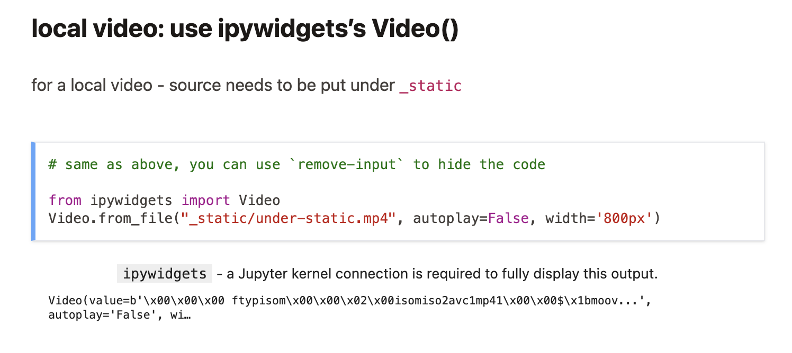

# migrating out of JB1

i.e. to JB2 or astro/starlight

## tooling

- [ ] Tweak nbnorm to
      - [ ] Put title first
      - [ ] Move license last
- [ ] Transform jlab-examples
- [ ] Transform flotpython-slides

## what we have now

| course | JB1 | JB2 | astro |
|--------|-----|-----|-------|
| intro  | <https://ue12-p24-intro.rtfd.io> | <https://ue12-p24.github.io/intro> | <https://ue12-p25.github.io/intro>
| numerique | <https://ue12-p24-numerique.rtfd.io> | <https://ue12-p25.github.io/numerique> | n/a
| jupyterlab-examples | <https://flotpython-jupyterlab-examples.rtfdio>

## JB1

## pros

- [ ] all supports were using this as of p24
- [ ] easy recipe to publish on readthedocs

### cons

- [ ] **no longer supported**
- [ ] runs on sphinx, sloowww
- [ ] can **only** publish on readthedocs ? (probably doable on github pages too but we have no experience of that as of yet)

## JB2

### pros

- [ ] execute codes in notebooks
- [ ] see also the doc in <https://mystmd.org/guide/directives>

### cons

#### convenience / painful points

- [ ] misses the cheat shortcut to get corrections
- [ ] what with the `_static` thingy ?  
      see e.g. addresses-final.html in numerique/ which does not show up in the pages website
      it is referred to from an `iframe` directive with `_static/addresses-final.html`
- [ ] ipywidgets: a Jupyter kernel connection is required to fully display this output  
        
      also needed for
      - [ ] ipythontutor
      - [ ] nbautoeval

#### styling

- [ ] outline output cells
- [ ] outline input cells (blue is like untyped admonitions...)
- [ ] outline inline code
- [ ] favicons on the published end ? <https://ue12-p25.github.io/numerique/> has none but the local one is fine
- [ ] pandas dataframes
  - [ ] are not centered; not exactly serious either
  - [ ] hovering used to outline the whole row, now just the first cell in the row
- [ ] add external urls in TOC
      ```
      ⚠️  myst.yml URLs in table of contents are not yet supported: https://flotpython-exos-ds.readthedocs.io/en/main/ds-tps/images/README-images1-nb.html
      ```

#### second order

- [ ] not sure about the slug thing; can we override the default function ?
- [ ] would be nice to be able to rename `myst.yml` into `_myst.yml`
- [ ] inline images ?
- [ ] jupyterlite embeddings not working at all

#### fixed

- [x] equation from
  http://localhost:3000/numpy-tp-dices-advanced-nb#version-pour-les-d-butants
  rendered oddly (but better than jb1 for that matter)  
  fixed by adding an extra {equation} environment around it

## astro / starlight

### pros

- [ ] large community
- [ ] very robust
- [ ] very complete

### cons

- [ ] not notebooks, code is not executed...
